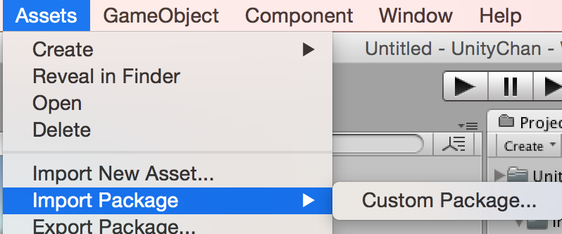
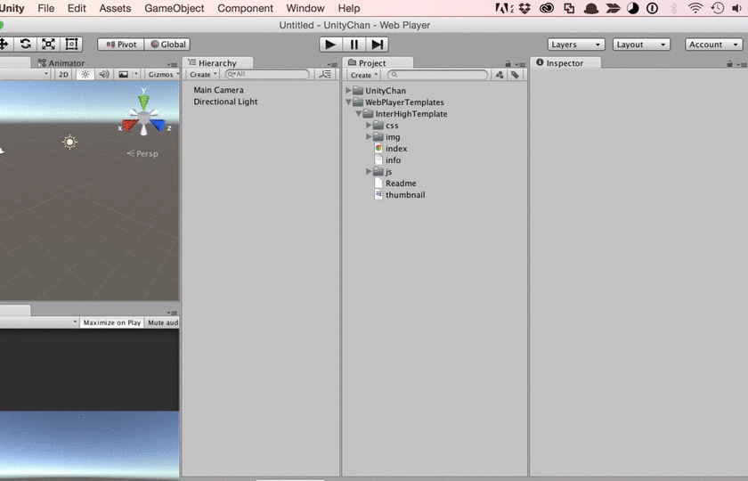
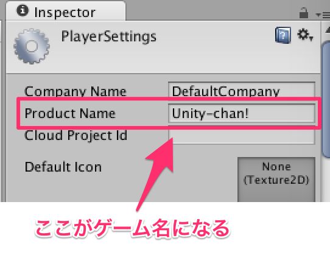
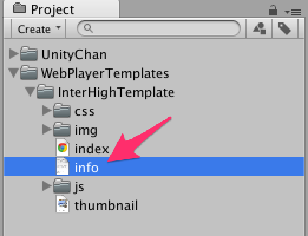
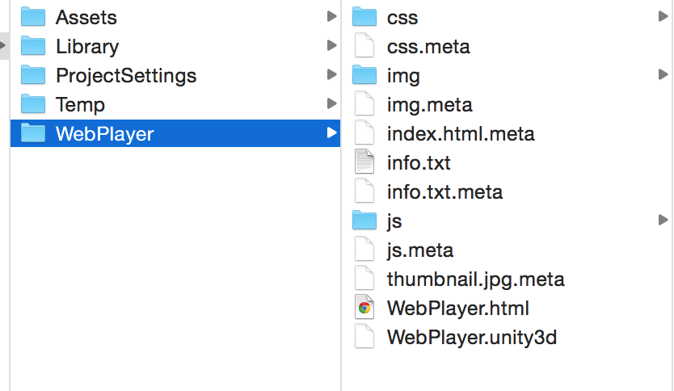

# Unityインターハイ用WebPlayerテンプレートの使い方

## テンプレートを使う準備

メニューの「Assets/Import Package/Custom Pakage」より InterHighTemplate.unitypackage を選択して、Unityプロジェクトにアセットをインポートします。



次に「Player Settings」を開きます。そして、WebPlayerの項目を開き、Webplayer Template でインポートしたテンプレートを使用するためにインターハイのロゴがサムネイル画像となっているものをマウスでクリックします。



次に、ゲーム名を設定します。「Player Settings」を開き、Product Name にゲーム名を入力します。



学校名、チーム名、メンバー、ゲーム説明を記入します。インポートしたファイルの中にある **info.txt** をテキストエディタ等で開きます。



以下のテキストのように info.txt に記入します。

```

## 学校名

小碓学園

## チーム名

こはくちゃんズ

## 開発メンバー

大鳥こはく、神林ゆうこ、藤原みさき

## ゲーム説明

このゲームはユニティちゃんがダッシュとジャンプでコインを集めるアクションゲームです。

Bボタンで3種類のスキルを使うことができ、それをうまく駆使するのがゲームのコツです。
3種類のスキルを使って連続で敵を倒すとユニティちゃんがパワーアップし、コインが大量に出現します！
敵を倒しながら、コインを全部集めるとゲームクリアとなります。
スキルで敵をふっとばす爽快感がこのゲームの一番おもしろいところです！

※マウスでもプレイできますが、Xbox系またはPS系ゲームパッドの使用を推奨しています。
```

以上で設定は終了です。


## テンプレートを使ってビルド

WebPlayer用のデータをビルドします。いつものように「Build Settings」で **Build** ボタンを押します。

ビルドされたものが以下の画像のようになっていれば成功です。


